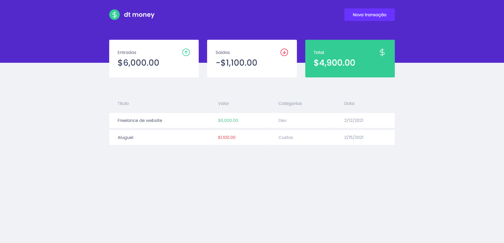
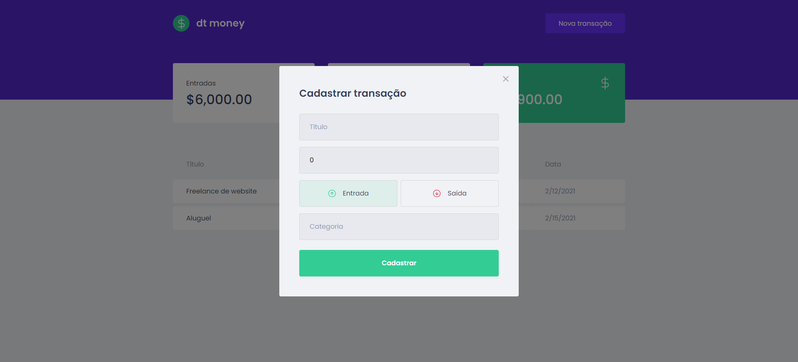

## 🚀 About the Project

## 💻 Project Image

<div align="center">
    
    
   </br>
</div>

## 🧰 Technologies
This project was developed with the following technologies:
* CSS3
* HTML
* JavaScript
* ReactJS
* TypeScript
* StyledComponents

## ⚙️ Installation
```bash
# You need to install Node.js, then in order to clone the project via HTTPS, run this command:
$ https://github.com/LeonardoMarquesDias/MyFinances
# or use the download option.

# Install dependencies
$ yarn install
or
$ npm install

# Run the following command to start the fake API with JSON Server to simulate an API that has foods information:
$ yarn server
or
$ npm server

# Run the following command to start the application in a development environment:
$ yarn start
or
$ npm start

# Access http://localhost:3000 
```

## 📝 License

This project is licensed under the MIT License - see the LICENSE file for details.

---

by [Leonardo Dias](https://github.com/LeonardoMarquesDias) 😛
